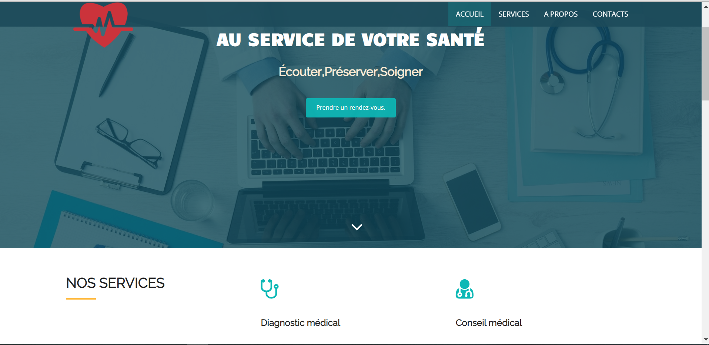
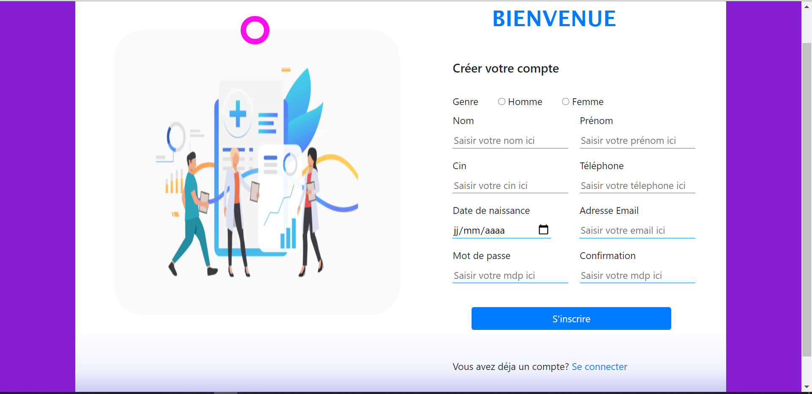
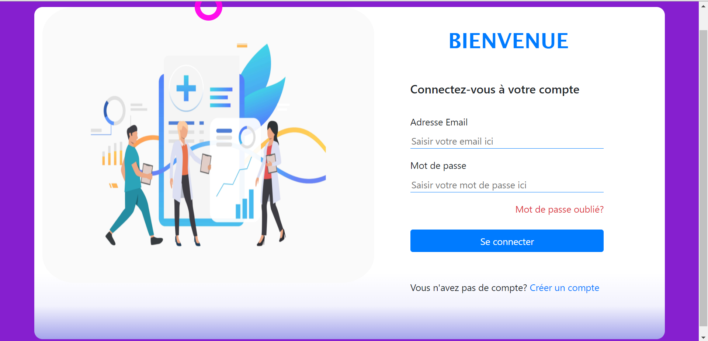
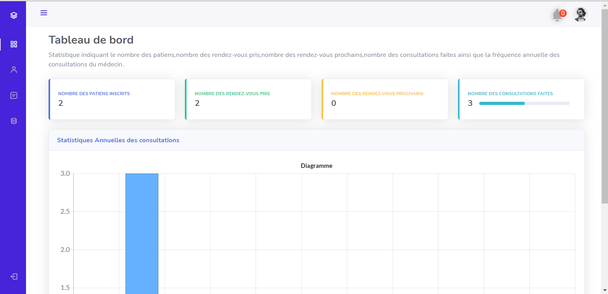
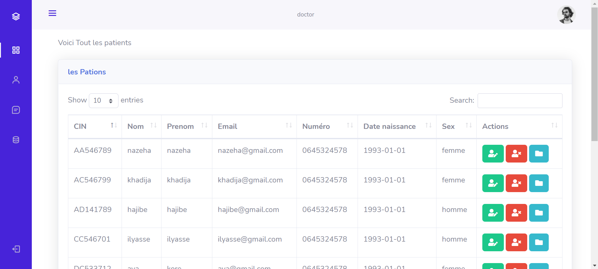
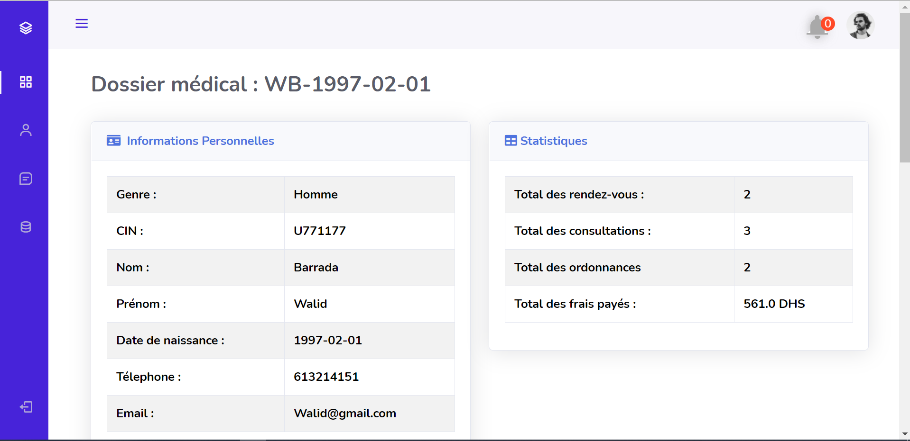
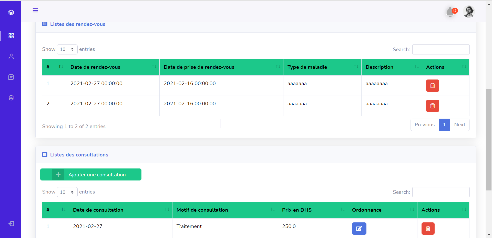
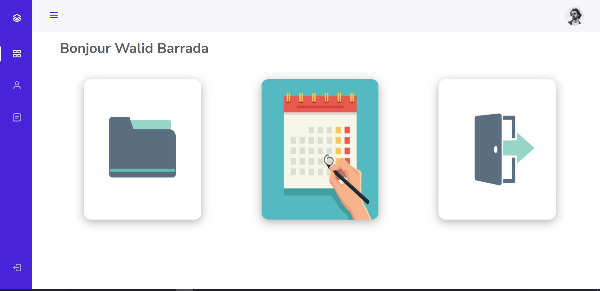
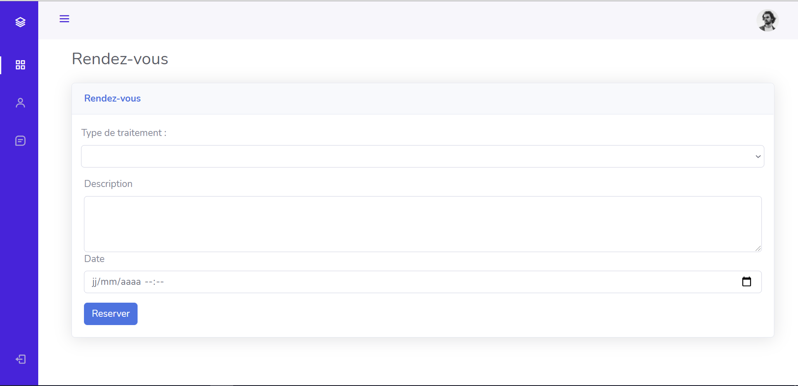

# ***Application de gestion de cabinet médical***

#### **Contributeurs :**
Ce projet a été réalisé sous la collaboration de :
  
  * [Ayoub HMADOUCH ](https://github.com/AyoubHmadouch)
  * [Abdessamad EL HAFI](https://github.com/abdoelhafi)
  * [FOUAD EL FAKHORI](https://github.com/fFakhori)
  * [Abderahmane KOTBI](https://github.com/abdorah)

#### **Supervisé par** 
* Pr. Mahmoud EL HAMLAOUI

---
### **Objectif du projet:**
Le but de ce projet est de concevoir et de développer une application qui permet la gestion d'un cabinet médical(Prise des rendez-vous en ligne,gestion des patients...),en utlisant la plateforme de développement JAVA EE.

---
### **Outils de développement**

<table>
    <thead>
        <th>Front-end</th>
        <th>Back-end</th>
        <th>Conception</th>
        <th>Autres</th>
    </thead>
    <tbody>
        <tr>
            <td>HTML</td>
            <td>Java EE (Tomcat server,Servlet,Jsp,MVC,DAO,JUnit)</td>
            <td><a href=https://www.planttext.com/">planttext</a></td>
             <td>Git/Github</td>
        </tr>
        <tr>
            <td>CSS</td>
            <td>MySQL (SGBD)</td>
            <td></td>
              <td>Docker</td>
        </tr>
         <tr>
            <td>Javascript</td>
            <td></td>
            <td></td>
              <td>Docker-composer</td>
        </tr>
        <tr>
            <td>Bootstrap</td>
            <td></td>
            <td></td>
             <td></td>
        </tr>
    </tbody>
</table>

---

### **Interfaces de l'application**
* **Accueil**
  
 

* **Inscription**

* **Authentification**

* **Tableau de bord de docteur**

* **Liste des patients**

* **Dossier médical du patient**

* **Ajouter une consultation par le docteur**

* **Accueil du patient**

* **Prendre un rendez-vous par le patient**

